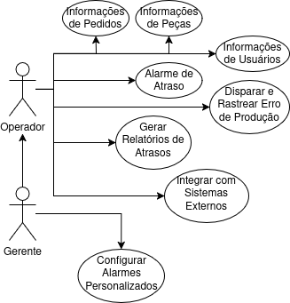

# Casos de Uso

1. Informações de Pedidos: 

> registro, consulta e edição de informações sobre pedidos de produção. Os usuários podem cadastrar novos pedidos por meio de um formulário, consultar dados existentes no banco de dados e editar informações sobre as peças vinculadas aos pedidos.  

    Informações de Pedido podem ser cadastradas via formulário.
    Informações de Peças podem ser consultados em banco de dados.
    Gerentes podem editar informações sobre as peças. 

2. Informações de Peças: 
> registro, consulta e edição de informações sobre peças de produção. As informações podem ser registradas via OCR (reconhecimento óptico de caracteres) ou inseridas diretamente no banco de dados via arquivo JSON.  

    Informações de Peças podem ser registradas via OCR.
    Informações de Peças podem ser registradas em banco de dados via json.
    Informações de Peças podem ser consultados em banco de dados.
    Gerentes e Operadores podem editar informações sobre as peças. 

3. Informações de Usuários: 
> registro, consulta e edição de informações sobre usuários. Usuários tem níveis de permissão diferente: Gerente ou Operador. Pode estar vinculado a Pedidos.   

    Gerentes podem editar Pedido, Operadores não.
    Informações de Usuários podem ser consultados em banco de dados.
    Edições em Pedidos ou Peças devem registrar Usuário responsável pela modificação.
    Gerentes e Operadores podem editar informações sobre as peças, mas apenas Gerentes podem excluir Peças.
    
4. Configurar Alarmes Personalizados: 
> Este caso de uso permite a configuração de alarmes personalizados no sistema, que podem ser ajustados conforme as necessidades da produção. Esses alarmes podem ser programados para alertar sobre diferentes eventos, como atrasos na produção ou falhas em máquinas.

    Sistema permite a configuração de alarmes personalizados.
    Configuração de mensagens e destinatários das notificações.

5. Disparar e Rastrear Erro de Produção:
> Sistema dispara notificações de erros em peças (atrasos); é possível rastrear Peça, Pedido e Lote.  

    O sistema rastreia erro em peça específica e mostra máquina onde peça se encontra.
    tempoInicio é atualizado a partir da mudança de Máquina de Peça.
    Quando o tempo de início de uma peça ultrapassa o tempo máximo permitido, um alarme é disparado, notificando os operadores sobre o atraso.
    O sistema também associa o atraso ao pedido correspondente, permitindo a rastreabilidade do problema até o pedido original.

6. Alarme de Atraso:
> Visualização de alarmes de Atrasos em Peças  

    O alarme contém informações detalhadas sobre a peça, o lote e o pedido associado, permitindo que os operadores identifiquem a origem do atraso.
    O alarme é registrado em um histórico para análise posterior. A notificação inclui detalhes sobre a peça, o lote e o pedido associados.
    O sistema exibe informações como o tempo de início da peça, o tempo máximo configurado, o tempo decorrido e o pedido relacionado. 
    O sistema associa automaticamente os atrasos de produção aos pedidos correspondentes. 

7. Gerar Relatórios de Atrasos:
> Visualização e exportação de Relatórios de Atrasos em Peças e Lotes.  

    Sistema gera relatórios detalhados sobre os atrasos de produção. 
    Relatórios incluem informações como o número de peças atrasadas, os lotes afetados e os pedidos impactados.
    Sistema monitora o progresso de cada lote de produção.
    Se um lote estiver atrasado, o sistema gera alertas para os operadores e gerentes. 
    
8. Integrar com Sistemas Externos
> Integração com o sistema e banco de dados de empresa interessada.

    O sistema pode ser integrado com ERPs ou MES (Manufacturing Execution Systems) dos stakeholders.
    

# Diagrama de Casos de Uso

